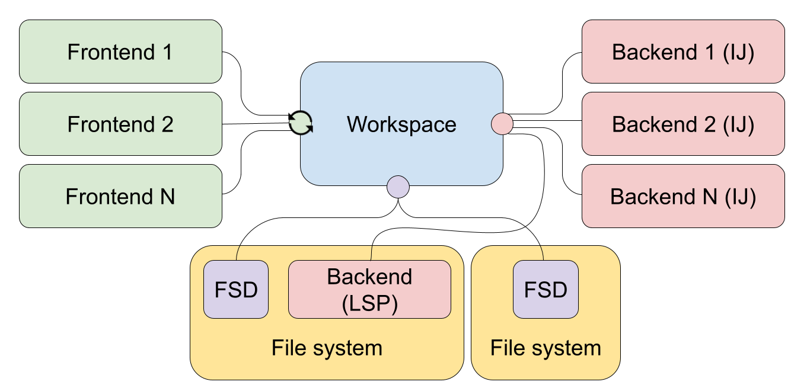
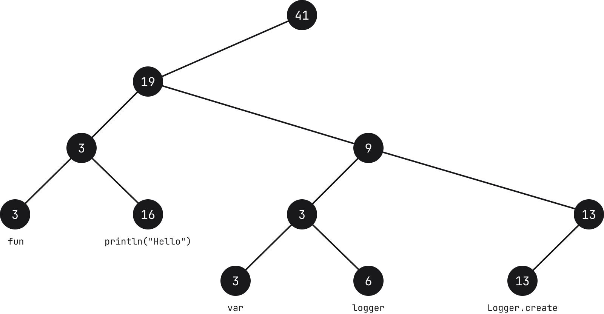
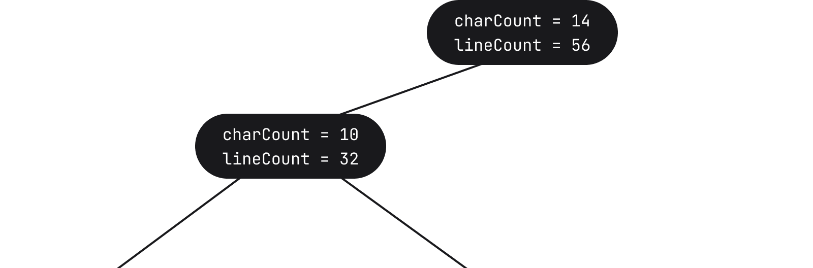
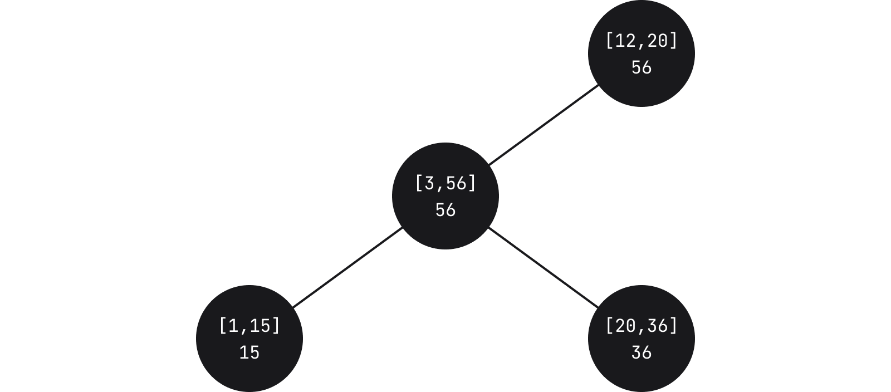
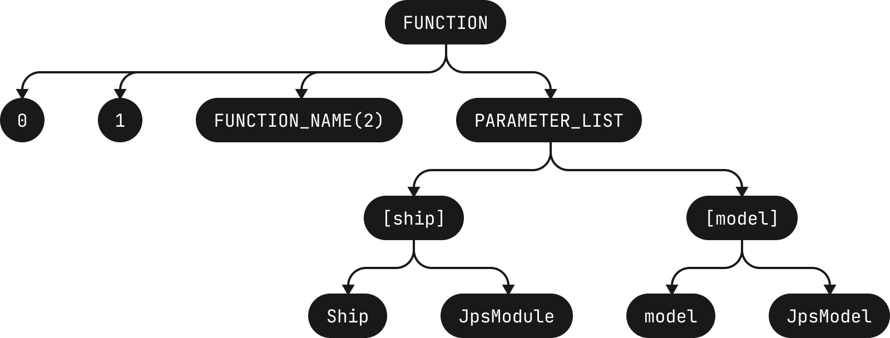
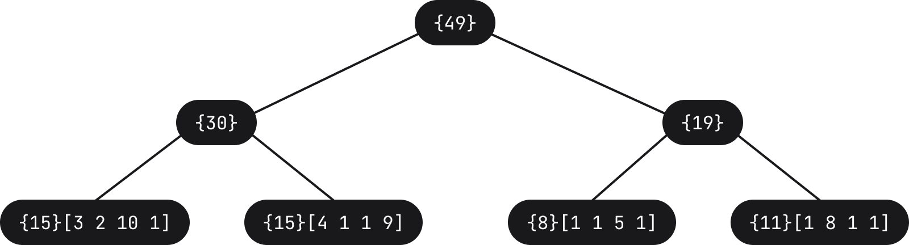
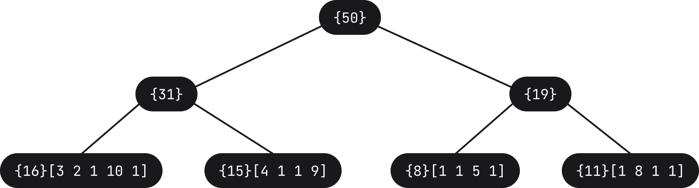
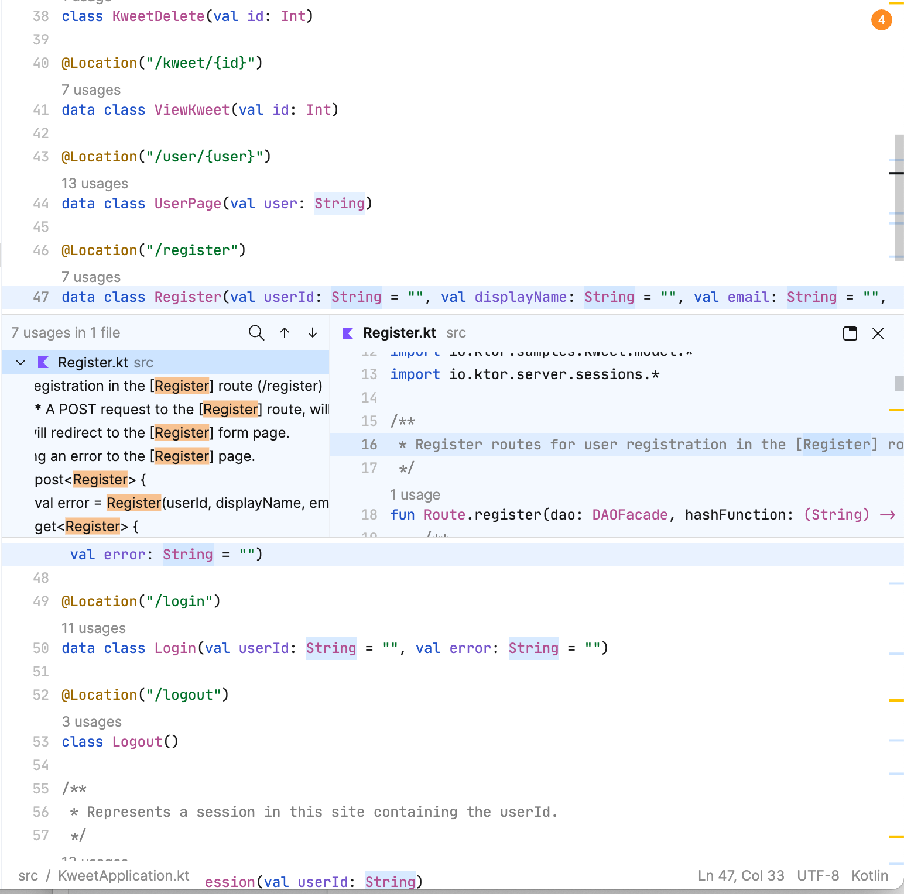

# 第一部分 - 架构概述

我们最近宣布了一款一直在开发的新产品，这款产品的名称为 [Fleet](https://www.jetbrains.com.cn/fleet/)，是由 JetBrains 打造的新一代 IDE。 该产品目前处于封闭预览阶段，我们收到了来自尝鲜者的大量反馈，帮助我们改进产品并为在 2022 年的公开预览做好准备。

同时，在我们准备好供公众访问之前，我们想与您谈谈 Fleet 是如何在后台构建的。 在一系列的博文中，我们将深入探讨 Fleet 的各个方面，从顶层的架构视图，到状态管理、解析器、协议、可扩展性，甚至是徽标设计等小细节。 我们希望您喜欢了解这次后台探秘！

## Fleet 是用什么技术构建的？

当我们第一次宣布 Fleet 时，Twitter 上发生了一些有趣的对话，讨论它是用什么技术构建的。 一些人认为是用 JavaScript 和 Electron， 其他人则希望不是。 有些人对没有使用“笨重老式的 Java”感到非常高兴。 令人惊讶的是，人们可以仅根据屏幕截图推断出多少！

事实是，Fleet 是在可靠、高性能、美妙的 JVM 平台上构建的。 是。 JVM。 为什么？ 因为与流行的看法相反，JVM 实际上是一个性能非常高的平台。 此外，它是跨平台的，在支持多个操作系统时使事情变得更容易。

然而，JVM 并不是专门为 Java 语言提供的主机，也不要求您使用 Swing 作为 UI 库（关于 UI 和 Fleet 如何使用 Skia 的更多内容请见后续博文）。 事实上，您可以在 JVM 上使用各种语言，例如 Kotlin。 这正是我们构建 Fleet 所用的语言 – Kotlin。

然而，作为一个真正的多语言 IDE，Fleet 本身也是多语言的。 没错，Fleet 的一小部分，尤其是 Fleet System Daemon，是用 Rust 构建的！

## Fleet 架构

我们现在已经知道 Fleet 是用什么技术来构建的，让我们来看看架构的简要概述。 Fleet 由以下组件构成：

让我们将这些组件逐一分解，以更好地理解它们的作用。

**前端**

虽然我们可能会认为前端就是用户界面，但实际上它的作用更大。 它不仅是用户界面，而且还提供以下功能：

-   文件解析
-   语法高亮显示和基本补全
-   编辑器功能

Fleet 默认在编辑器模式下启动，您可以在这里获得基本补全和导航，以及您期望从任何强大的编辑器获得的功能。 所有这些功能都是由 Fleet 的前端提供的。

**工作区**

顾名思义，工作区是处理工作会话相关事务的地方。 诸如状态管理等方面都由工作区来处理。 这个功能可以在 Fleet 的进程中运行，也可以作为单独的进程运行（具体取决于它是否在计算机的本地），因此，允许工作区在远程服务器上运行。

**智能模式和后端**

如上所述，Fleet 可以作为一个编辑器运行。 但是，如果需要更高级的功能，例如智能代码补全、高级导航、重构和检查等其他功能，那么**智能模式**就可以发挥作用。
这种智能模式可以由各种选项提供支持，包括默认的 IntelliJ IDEA 代码处理引擎、自定义分析器，甚至是语言服务器（无论这些是否基于 LSP）。

**Fleet System Daemon (FSD)**

这个组件是用 Rust 编写的，负责构建操作、运行代码、执行终端命令，以及 Fleet 运行环境中的其他操作。所有这些组件一起提供了一个分布式和可扩展的解决方案。 在后续博文中，我们将深入探讨用于构建这些组件的技术，以及用于它们之间通信的协议。

# 第二部分 - 编辑器详解

## 数据结构的聚合

请查看以下屏幕截图，其中展示了 Fleet 中的编辑器窗口

图中包含一行带有语法高亮显示的文本，以及一个提供特定变量用法相关信息的微件。 现在，人们可以通过多种方式显示这些信息，但编辑器方面的问题是它们并非只读。 除了数据可视化以外，数据还可以更新。 诸如更改函数名称这样简单的操作就可能会造成许多影响，例如影响语法突出显示、用法，当然还包括提供的任何其他功能，例如静态分析或实时编译。

为能提供良好的体验，我们需要确保编辑文本和随之呈现的可视化可以尽可能无缝衔接。 为了实现这一点，我们必须以有效的方式存储和处理数据。 然而，存储数据的方式并非只有一种。 事实上，上图就以多种方式存储数据，它们使用各自不同的数据结构，这些数据结构共同构成了我们所说的编辑器。 换言之，可以将编辑器视为数据结构的聚合器！

我们来详细介绍！

## 绳索全线贯通

对于熟悉处理大量文本的人来说，您可能已经知道使用字符串（即字符数组）进行存储的效率并不理想。 通常，对数组执行任何运算都意味着必须创建一个更大或更小的新数组，并将旧数组的内容复制到新数组。 这种方式很难保证效率。

效果更好且更加标准化的方式是使用[绳索结构](https://en.wikipedia.org/wiki/Rope_(data_structure))。 这种抽象数据类型背后的理念是将字符串存储在树上的叶节点中。

每个叶节点都包含一个字符串（请参阅下方注释）及其长度（称为权重）。 每个中间节点也包含一个权重，它是其左侧子树中所有叶节点的权重的总和。

_****注**：叶节点上使用的文本只是一个示例，并不代表实际文本在 Fleet 中的分解方式。**_

在上面的示例中，如果我们以容纳字符 _fun_ 的节点为例，则该节点的计数为 3，因为字符串长度为 3。 上移到父节点，计数也是 3，因为其左侧所有节点的权重之和为 3。 继续向上，该节点的父节点的计数则为 19，这是它左侧叶节点 3 和 16 的总和。

搜索、追加、移除、拆分字符串等常见操作的时间复杂度为 O(log N)，其中 N 是字符串的长度。 运算从遍历树开始，鉴于节点信息，这种方式可以加快运算速度。 例如，如果我们要找到位置为 _i =_ 30 的字符，从节点开始，用 i 减去（请参阅下方注释）权重值，如果 30 小于节点的权重（字符数），则我们向左查找。 另一方面，如果 _i_ 大于权重，我们将向右查找。 随着我们向下移动且 _i_ 值不断减小，当我们找到叶节点所容纳字符串为 _i_ 的位置，该位置的字符就是我们所查找的字符。 

_****注**：根据使用的指标，可能并不需要减法运算。 _重要的是，当我们沿着树向下查找时，我们会累积到该点的指标，并将其与我们正在搜寻的键进行比较。_**_ 

在 Fleet 的绳索结构中插入或删除节点时，我们使用自平衡 [B-Tree](https://en.wikipedia.org/wiki/B-tree)。 我们首先读取 64 个字符的块，一旦达到 32 个块，我们就创建一个节点并开始为第二个节点收集块。 每个节点包含两个数字 – 除了权重，我们还会存储行数（两者的组合就是我们所说的_指标_）

通过存储行数，我们可以更快地导航到特定的偏移量。 在 Fleet 中，树的另一个特征是我们希望使之更宽，而非更深。

### 将区间树用于微件等

正如我们之前所看到的，一段代码可能不仅包含实际文本，还包含诸如_用法_等其他元素。

我们将这些元素称为微件，它们可以是行间微件（例如 _Find Usages_（查找用法）或 _Run_（运行）微件）、行后微件（例如出现在代码行之后的调试信息）或嵌入微件（例如变量和 lambda 的类型提示）。 

微件本身只是一个标记元素，容纳微件的数据结构为[区间树](https://www.geeksforgeeks.org/interval-tree/)的变体，在某种程度上也是一种绳索结构。 在区间树中，节点容纳一个区间，权重对应于子树中区间的最大值。

在 Fleet 中，每个节点都包含子节点的相对起点和终点。 叶节点又包含一个实际微件。 运行查询以查看是否需要根据某个特定坐标显示特定微件时，我们会遍历树，直至找到与我们所查询的区间存在交集的区间为止。

一个重要的方面是叶节点还包含微件 ID。 这意味着除了查询与特定区间的交集，对于任何微件，我们还可以查询以确定其实际位置。

Fleet 中采用了一种标准区间树的变体，我们允许节点重叠。 这有可能会导致搜索效率降低，但允许节点重叠可以创建平衡的树，并使树可以在我们输入时更新。

除了微件以外，Fleet 中的区间树还被用于跟踪文本光标、高亮显示文本以及文本中被我们称为定位标记的_粘性_位置。

### 将绳索用于词例和抽象语法树

处理源代码时，无论是编译器还是编辑器，您通常都会使用抽象语法树 (AST)。 工作方式为解析器分析源代码并创建一系列词例。 随后，这些词例将用于构建 AST。以如下代码为例

`fun compileBundles(ship: JpsModule, model: JpsModel, src: SrcBundles): DstBundles`

它将被分解为以下词例

`[fun][ ][compileBundles][(][ship][:][ ][JpsModule][,][ ][model][:][ ][JpsModel][,][ ][src][:][ ][SrcBundles][)][:][ ][DstBundles]`

其中，每组方括号都表示一个词例（请注意，空格也是词例）。 随后，这些词例将用于构建相应的 AST

随后，AST 将被用于各种运算，例如语法高亮显示、静态分析等。 它是任何 IDE 的重要组成部分。

_顺带一提，如果您有兴趣了解如何将某些代码转译成 AST，请了解一下这款_[_超酷的在线 AST 浏览器_](https://astexplorer.net/)_（它提供了对多种语言的支持）_

我们在编辑器中输入时，文本会发生变化，这意味着词例会发生变化，这转而需要构建新的 AST 以便提供上述功能。

在 Fleet 中，为了避免直接更新 AST，我们使用绳索结构将词例存储在叶节点中（实际上仅存储长度）。 举例来说，上文中的词例列表可以表示为以下树

当用户输入空格字符等内容时，树会更新（最左侧的叶节点的长度将增加 1，进而导致沿该路径的计数增加）

特定叶节点使新词例长度增大，转而会导致树的某些节点发生更新以调整权重。 随后，解析器会收到通知，强制它更新和重新解析 AST。 因此，AST 可能会有片刻不完全正确的情况，但在几乎不需要更新的编辑方面，用户体验要好得多。

### 将绳索用于渲染

下图是编辑器的另一个示例，但此次添加了一些附加元素，也就是将实际用法微件扩展为显示用法、自动换行以及诸如在滚动条中加入彩色竖线等其他元素。

要渲染上述内容，对于特定的 _Y_ 坐标，我们不仅需要清楚显示哪行，还需要考虑到所有微件和自动换行的行。 

***有趣的事实**：用法微件中渲染的编辑器使用与我们在本文中所探索的相同底层数据结构。 _对于同一文件中的用法，构建和渲染此叠加编辑器使用了相同的绳索。_**_

微件和自动换行信息也会存储为绳索结构。 虽然之前树的叶节点会容纳字符串及其长度，但在此例中，我们将使用叶节点来保存我们所谓的 _SoftLine_ 对象。 这些是带有高度的文本块，被视为视觉线。 此例中节点的权重（我们称为指标）为 _SoftLine_ 的高度和长度。 存储高度是为了能够支持视口查询。 此高度受位于它内部的中间行影响。 此外，当启用自动换行时，_SoftLine_ 不会与实际行一一对应，而是可以跨越多行。 

## 关于不变性的说明

值得一提的是，我们在 Fleet 中拥护不变性。 使用纯函数和不可变对象有很多好处。 纯函数不仅使我们能够更好地思考代码，而且还可确保调用函数不会在我们不知情的情况下导致系统的其他部分发生变化（即出现副作用）。 在数据方面，知道对象为不可变对象意味着它具备线程安全性，因此在尝试任何更新时不会出现竞争条件。 对于多线程环境，这提供了巨大的好处。

这种不变性理念也是使用绳索结构的运算的核心。 之前我们谈到了如何更新节点和树的叶节点。 这些都是以不可变的方式完成的 – 树上的任何运算都会产生与旧树共享结构的树的新副本，差别仅限从根到需要更改的单个节点。 鉴于树通常宽度较大而深度较小这一事实，这一路径将很短。 如果运算导致出现任何未引用的节点，将对这些节点进行垃圾回收。

这与我们在 IntelliJ 平台上使用读写锁定机制执行变更的方法截然不同。

# 总结

正如我们在这个关于如何构建 Fleet 的第二部分中所见，可供输入和浏览代码的编辑器看似简单，实则为十分复杂的多种不同数据结构的底层聚合，其中多为绳索结构。 如果您有兴趣详细了解绳索，请务必参阅[绳索科学](https://xi-editor.io/docs/rope_science_00.html)系列内容，它对我们在 Fleet 上所做的工作产生了重大影响。

英文博文原作者：

Hadi Hariri