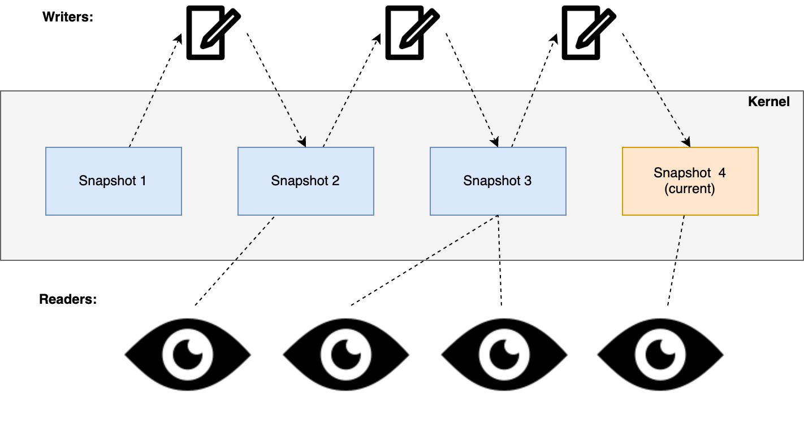
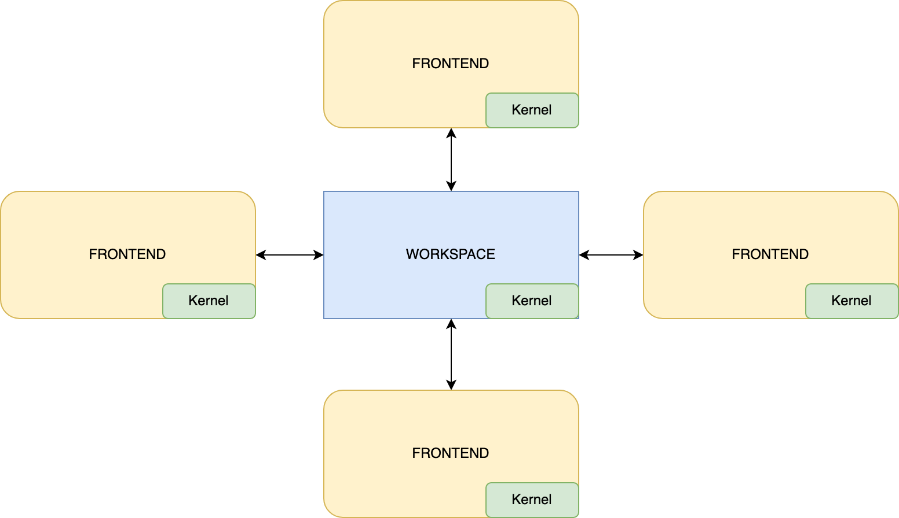

# 第一部分 - 架构概述

我们最近宣布了一款一直在开发的新产品，这款产品的名称为 [Fleet](https://www.jetbrains.com.cn/fleet/)，是由 JetBrains 打造的新一代 IDE。 该产品目前处于封闭预览阶段，我们收到了来自尝鲜者的大量反馈，帮助我们改进产品并为在 2022 年的公开预览做好准备。

同时，在我们准备好供公众访问之前，我们想与您谈谈 Fleet 是如何在后台构建的。 在一系列的博文中，我们将深入探讨 Fleet 的各个方面，从顶层的架构视图，到状态管理、解析器、协议、可扩展性，甚至是徽标设计等小细节。 我们希望您喜欢了解这次后台探秘！

## Fleet 是用什么技术构建的？

当我们第一次宣布 Fleet 时，Twitter 上发生了一些有趣的对话，讨论它是用什么技术构建的。 一些人认为是用 JavaScript 和 Electron， 其他人则希望不是。 有些人对没有使用“笨重老式的 Java”感到非常高兴。 令人惊讶的是，人们可以仅根据屏幕截图推断出多少！

事实是，Fleet 是在可靠、高性能、美妙的 JVM 平台上构建的。 是。 JVM。 为什么？ 因为与流行的看法相反，JVM 实际上是一个性能非常高的平台。 此外，它是跨平台的，在支持多个操作系统时使事情变得更容易。

然而，JVM 并不是专门为 Java 语言提供的主机，也不要求您使用 Swing 作为 UI 库（关于 UI 和 Fleet 如何使用 Skia 的更多内容请见后续博文）。 事实上，您可以在 JVM 上使用各种语言，例如 Kotlin。 这正是我们构建 Fleet 所用的语言 – Kotlin。

然而，作为一个真正的多语言 IDE，Fleet 本身也是多语言的。 没错，Fleet 的一小部分，尤其是 Fleet System Daemon，是用 Rust 构建的！

## Fleet 架构

我们现在已经知道 Fleet 是用什么技术来构建的，让我们来看看架构的简要概述。 Fleet 由以下组件构成：

让我们将这些组件逐一分解，以更好地理解它们的作用。

**前端**

虽然我们可能会认为前端就是用户界面，但实际上它的作用更大。 它不仅是用户界面，而且还提供以下功能：

-   文件解析
-   语法高亮显示和基本补全
-   编辑器功能

Fleet 默认在编辑器模式下启动，您可以在这里获得基本补全和导航，以及您期望从任何强大的编辑器获得的功能。 所有这些功能都是由 Fleet 的前端提供的。

**工作区**

顾名思义，工作区是处理工作会话相关事务的地方。 诸如状态管理等方面都由工作区来处理。 这个功能可以在 Fleet 的进程中运行，也可以作为单独的进程运行（具体取决于它是否在计算机的本地），因此，允许工作区在远程服务器上运行。

**智能模式和后端**

如上所述，Fleet 可以作为一个编辑器运行。 但是，如果需要更高级的功能，例如智能代码补全、高级导航、重构和检查等其他功能，那么**智能模式**就可以发挥作用。
这种智能模式可以由各种选项提供支持，包括默认的 IntelliJ IDEA 代码处理引擎、自定义分析器，甚至是语言服务器（无论这些是否基于 LSP）。

**Fleet System Daemon (FSD)**

这个组件是用 Rust 编写的，负责构建操作、运行代码、执行终端命令，以及 Fleet 运行环境中的其他操作。所有这些组件一起提供了一个分布式和可扩展的解决方案。 在后续博文中，我们将深入探讨用于构建这些组件的技术，以及用于它们之间通信的协议。

# 第二部分 - 编辑器详解

## 数据结构的聚合

请查看以下屏幕截图，其中展示了 Fleet 中的编辑器窗口

图中包含一行带有语法高亮显示的文本，以及一个提供特定变量用法相关信息的微件。 现在，人们可以通过多种方式显示这些信息，但编辑器方面的问题是它们并非只读。 除了数据可视化以外，数据还可以更新。 诸如更改函数名称这样简单的操作就可能会造成许多影响，例如影响语法突出显示、用法，当然还包括提供的任何其他功能，例如静态分析或实时编译。

为能提供良好的体验，我们需要确保编辑文本和随之呈现的可视化可以尽可能无缝衔接。 为了实现这一点，我们必须以有效的方式存储和处理数据。 然而，存储数据的方式并非只有一种。 事实上，上图就以多种方式存储数据，它们使用各自不同的数据结构，这些数据结构共同构成了我们所说的编辑器。 换言之，可以将编辑器视为数据结构的聚合器！

我们来详细介绍！

## 绳索全线贯通

对于熟悉处理大量文本的人来说，您可能已经知道使用字符串（即字符数组）进行存储的效率并不理想。 通常，对数组执行任何运算都意味着必须创建一个更大或更小的新数组，并将旧数组的内容复制到新数组。 这种方式很难保证效率。

效果更好且更加标准化的方式是使用[绳索结构](https://en.wikipedia.org/wiki/Rope_(data_structure))。 这种抽象数据类型背后的理念是将字符串存储在树上的叶节点中。

每个叶节点都包含一个字符串（请参阅下方注释）及其长度（称为权重）。 每个中间节点也包含一个权重，它是其左侧子树中所有叶节点的权重的总和。

_****注**：叶节点上使用的文本只是一个示例，并不代表实际文本在 Fleet 中的分解方式。**_

在上面的示例中，如果我们以容纳字符 _fun_ 的节点为例，则该节点的计数为 3，因为字符串长度为 3。 上移到父节点，计数也是 3，因为其左侧所有节点的权重之和为 3。 继续向上，该节点的父节点的计数则为 19，这是它左侧叶节点 3 和 16 的总和。

搜索、追加、移除、拆分字符串等常见操作的时间复杂度为 O(log N)，其中 N 是字符串的长度。 运算从遍历树开始，鉴于节点信息，这种方式可以加快运算速度。 例如，如果我们要找到位置为 _i =_ 30 的字符，从节点开始，用 i 减去（请参阅下方注释）权重值，如果 30 小于节点的权重（字符数），则我们向左查找。 另一方面，如果 _i_ 大于权重，我们将向右查找。 随着我们向下移动且 _i_ 值不断减小，当我们找到叶节点所容纳字符串为 _i_ 的位置，该位置的字符就是我们所查找的字符。 

_****注**：根据使用的指标，可能并不需要减法运算。 _重要的是，当我们沿着树向下查找时，我们会累积到该点的指标，并将其与我们正在搜寻的键进行比较。_**_ 

在 Fleet 的绳索结构中插入或删除节点时，我们使用自平衡 [B-Tree](https://en.wikipedia.org/wiki/B-tree)。 我们首先读取 64 个字符的块，一旦达到 32 个块，我们就创建一个节点并开始为第二个节点收集块。 每个节点包含两个数字 – 除了权重，我们还会存储行数（两者的组合就是我们所说的_指标_）

通过存储行数，我们可以更快地导航到特定的偏移量。 在 Fleet 中，树的另一个特征是我们希望使之更宽，而非更深。

### 将区间树用于微件等

正如我们之前所看到的，一段代码可能不仅包含实际文本，还包含诸如_用法_等其他元素。

我们将这些元素称为微件，它们可以是行间微件（例如 _Find Usages_（查找用法）或 _Run_（运行）微件）、行后微件（例如出现在代码行之后的调试信息）或嵌入微件（例如变量和 lambda 的类型提示）。 

微件本身只是一个标记元素，容纳微件的数据结构为[区间树](https://www.geeksforgeeks.org/interval-tree/)的变体，在某种程度上也是一种绳索结构。 在区间树中，节点容纳一个区间，权重对应于子树中区间的最大值。

在 Fleet 中，每个节点都包含子节点的相对起点和终点。 叶节点又包含一个实际微件。 运行查询以查看是否需要根据某个特定坐标显示特定微件时，我们会遍历树，直至找到与我们所查询的区间存在交集的区间为止。

一个重要的方面是叶节点还包含微件 ID。 这意味着除了查询与特定区间的交集，对于任何微件，我们还可以查询以确定其实际位置。

Fleet 中采用了一种标准区间树的变体，我们允许节点重叠。 这有可能会导致搜索效率降低，但允许节点重叠可以创建平衡的树，并使树可以在我们输入时更新。

除了微件以外，Fleet 中的区间树还被用于跟踪文本光标、高亮显示文本以及文本中被我们称为定位标记的_粘性_位置。

### 将绳索用于词例和抽象语法树

处理源代码时，无论是编译器还是编辑器，您通常都会使用抽象语法树 (AST)。 工作方式为解析器分析源代码并创建一系列词例。 随后，这些词例将用于构建 AST。以如下代码为例

`fun compileBundles(ship: JpsModule, model: JpsModel, src: SrcBundles): DstBundles`

它将被分解为以下词例

`[fun][ ][compileBundles][(][ship][:][ ][JpsModule][,][ ][model][:][ ][JpsModel][,][ ][src][:][ ][SrcBundles][)][:][ ][DstBundles]`

其中，每组方括号都表示一个词例（请注意，空格也是词例）。 随后，这些词例将用于构建相应的 AST

随后，AST 将被用于各种运算，例如语法高亮显示、静态分析等。 它是任何 IDE 的重要组成部分。

_顺带一提，如果您有兴趣了解如何将某些代码转译成 AST，请了解一下这款_[_超酷的在线 AST 浏览器_](https://astexplorer.net/)_（它提供了对多种语言的支持）_

我们在编辑器中输入时，文本会发生变化，这意味着词例会发生变化，这转而需要构建新的 AST 以便提供上述功能。

在 Fleet 中，为了避免直接更新 AST，我们使用绳索结构将词例存储在叶节点中（实际上仅存储长度）。 举例来说，上文中的词例列表可以表示为以下树

当用户输入空格字符等内容时，树会更新（最左侧的叶节点的长度将增加 1，进而导致沿该路径的计数增加）

特定叶节点使新词例长度增大，转而会导致树的某些节点发生更新以调整权重。 随后，解析器会收到通知，强制它更新和重新解析 AST。 因此，AST 可能会有片刻不完全正确的情况，但在几乎不需要更新的编辑方面，用户体验要好得多。

### 将绳索用于渲染

下图是编辑器的另一个示例，但此次添加了一些附加元素，也就是将实际用法微件扩展为显示用法、自动换行以及诸如在滚动条中加入彩色竖线等其他元素。

要渲染上述内容，对于特定的 _Y_ 坐标，我们不仅需要清楚显示哪行，还需要考虑到所有微件和自动换行的行。 

***有趣的事实**：用法微件中渲染的编辑器使用与我们在本文中所探索的相同底层数据结构。 _对于同一文件中的用法，构建和渲染此叠加编辑器使用了相同的绳索。_**_

微件和自动换行信息也会存储为绳索结构。 虽然之前树的叶节点会容纳字符串及其长度，但在此例中，我们将使用叶节点来保存我们所谓的 _SoftLine_ 对象。 这些是带有高度的文本块，被视为视觉线。 此例中节点的权重（我们称为指标）为 _SoftLine_ 的高度和长度。 存储高度是为了能够支持视口查询。 此高度受位于它内部的中间行影响。 此外，当启用自动换行时，_SoftLine_ 不会与实际行一一对应，而是可以跨越多行。 

## 关于不变性的说明

值得一提的是，我们在 Fleet 中拥护不变性。 使用纯函数和不可变对象有很多好处。 纯函数不仅使我们能够更好地思考代码，而且还可确保调用函数不会在我们不知情的情况下导致系统的其他部分发生变化（即出现副作用）。 在数据方面，知道对象为不可变对象意味着它具备线程安全性，因此在尝试任何更新时不会出现竞争条件。 对于多线程环境，这提供了巨大的好处。

这种不变性理念也是使用绳索结构的运算的核心。 之前我们谈到了如何更新节点和树的叶节点。 这些都是以不可变的方式完成的 – 树上的任何运算都会产生与旧树共享结构的树的新副本，差别仅限从根到需要更改的单个节点。 鉴于树通常宽度较大而深度较小这一事实，这一路径将很短。 如果运算导致出现任何未引用的节点，将对这些节点进行垃圾回收。

这与我们在 IntelliJ 平台上使用读写锁定机制执行变更的方法截然不同。

## 总结

正如我们在这个关于如何构建 Fleet 的第二部分中所见，可供输入和浏览代码的编辑器看似简单，实则为十分复杂的多种不同数据结构的底层聚合，其中多为绳索结构。 如果您有兴趣详细了解绳索，请务必参阅[绳索科学](https://xi-editor.io/docs/rope_science_00.html)系列内容，它对我们在 Fleet 上所做的工作产生了重大影响。

# 第三部分 – 状态管理

在本系列的前几部分中，我们介绍了 Fleet 的总体架构，并探讨了编辑器后台用到的算法和数据结构。 在这一部分中，我们将介绍实现状态管理的方式。 这是一个复杂的主题，因此我们特别准备了多篇博文。 本篇的重点是应用程序状态元素的表示和存储， 下一部分将更细致地探讨 Fleet 中围绕状态管理的事务机制。

Fleet 有很多移动部件，也执行着许多不同的操作，包括：

-   呈现 UI 元素并与用户互动。
-   与其他服务交互以获取数据和更新 UI 元素。
-   处理文件，例如保存、加载、解析文件以及显示其差异。
-   编排处理代码洞察、补全和搜索结果的后端。

许多操作较为复杂，可能会降低界面的响应能力。 同时，由于 Fleet 是分布式应用程序，可能有多个分布在网络上的前端，使整个过程更加复杂。 尽管如此，我们还是必须持续为用户正确显示所有信息，确保用户可以在前端之间稳定地工作。

在状态管理上，操作分为读取状态和更新状态。 UI 元素读取状态后向用户提供实际数据，用户则通过编辑文档和移动内容来更新状态。 这样的操作每分钟有成千上万次， 也让正确的状态管理成为 Fleet 的关键要素。

## 我们的原则

JetBrains 在 IDE 开发上已有 20 多年的历史。 我们基于经验得出以下有关 Fleet 状态管理的指导原则：

### 原则 1：不要阻塞任何人

在并发环境下需要多加留意。 在 Kotlin（和 Fleet）中，我们使用称为协同程序的轻量级并发基元组织并发代码。 虽然同时从多个协同程序读取状态几乎不会产生任何问题，但更改它们可能带来危险。 传统方式是为单个写入器线程获取锁，这会导致读取某些内容的等待队列很长。 我们认为这并不合适，读取器应该能够无延迟地读取可能稍微过时的状态。 为了实现这种行为，我们使用 [MVCC（多版本并发控制）模型](https://en.wikipedia.org/wiki/Multiversion_concurrency_control)的一个变体访问协同程序中的状态元素。 这些协同程序要么读取某个版本的状态，要么通过提供新版本的状态更改状态。 在 MVCC 下，我们更容易在事务中读取状态和更改状态。

### 原则 2：高效做出反应

状态一直在变化，UI 应该立即反映这些变化。 只要您用自己掌握的第一门编程语言编写过动画，就知道如何做到这一点：擦除所有内容，从头开始重新绘制。 然而，完全重绘需要很多时间。 更好的做法是重新绘制有变化的部分。 为此，我们需要有能力确定到底是什么发生了变化。 变化越少越好。 找到状态有变化的部分后，就要尽快决定什么依赖于该部分并执行相应的协同程序。 我们必须高效地对状态变化做出反应。

### 原则 3：明智地表示数据

如果没有第三条原则，前两条原则不过是好听的声明。 我们必须认真思考存储和处理数据的方式。 具有高效查找和更改操作的存储已不再是数据库系统实现器的独有领域。 Fleet 作为分布式 IDE 也需要这些。 为了满足需求，我们必须开发自己的既灵活又高效的内部数据库解决方案。

## 什么是状态？

对于 Fleet 中的状态，我们需要考虑三个想法。

首先，它被表示为[持久数据结构](https://en.wikipedia.org/wiki/Persistent_data_structure)，具有不同版本，模型随时间变化。 一种描述方式是一个接一个的线性周期序列，即[周期时间模型](https://donnywinston.com/posts/the-materials-paradigm-and-epochal-time/)。 所有相关方（协同程序！）都会读取其中一个周期，但不一定是最近的周期。

其次，我们的状态是一个实体数据库，包含屏幕上以及后台所有内容的相关信息。 与许多数据库一样，这些实体以各种方式相互关联。

第三，状态及其更改归为基本的三元组，即 datom。它们是基元数据条目，让我们能够实现所需效率。 接下来，我们将详细讨论这些想法。

### 周期时间模型

很长一段时间里，我们的程序都会更改状态。 然而，仅仅更新一个变量几乎从不足够。 通常，我们必须一致地逐一做出大量更改。 如果有人观察到我们不成熟的状态，甚至试图更改它，该怎么办？ 假如我们增加了字符串的长度，但没有提供新内容。 用户绝对不应该看到这一点。 这时，应在某些遮蔽后隐藏不一致的状态。 从一个一致状态需要经过一段时间才能到下一个状态。 这就像一个周期跟随另一个周期。

Rich Hickey 在他的精彩演讲 [Are We There Yet](https://www.infoq.com/presentations/Are-We-There-Yet-Rich-Hickey/)（查看[语音稿](https://github.com/matthiasn/talk-transcripts/blob/9f33e07ac392106bccc6206d5d69efe3380c306a/Hickey_Rich/AreWeThereYet.md)）中首次向更广泛的编程社区解释了周期时间模型，展示了他关于实现 Clojure 编程语言的想法。 他讲到，在一段时间内，我们的程序可以存在于一个不可变的一致世界中。 不可变性使许多东西都更容易实现，但没有什么可以永远处于同一个世界里。 由于状态写入器的活动，一个新的不可变的一致世界总是跟随前一个世界。

Fleet 的状态可以通过不可变快照的形式访问，快照是所有状态元素的集合并且状态元素间的一致性得到保证。 在这个模型中，更新状态会创建一个新快照。 为了保证状态变化的一致性，我们实现了事务。

Fleet 有一个被称为_内核_的组件，它负责根据状态写入器的活动转换快照并提供对最新快照的引用。 相关各方，无论是读取器还是写入器，都可以在需要时获得此引用，但无法确定此引用在使用时是否与世界的最新版本相对应。 内核还负责向依赖它们的各方广播变化。 好在我们不需要手动订阅，只要读取一些值，然后在未来获得其变化的通知就够了。


写入器排队创建新快照，但读取器永远不会被阻塞。 然而，它们可能会收到稍微过时的信息。

### 我们状态的数据模型

现在我们将回答这个问题：我们的状态中有什么？ 它包含所有东西：文档内容及其相应文件信息、该内容的所有推断信息、文本光标位置、加载的插件及其配置、视图和面板位置等。 相应数据模型在 Fleet 中通过 Kotlin 接口描述为：

```kotlin
interface DocumentFileEntity : SharedEntity {
	@Unique
	@CascadeDeleteBy
	var document: DocumentEntity
	
	@Unique
	var fileAddress: FileAddress
	var readCharset: DetectedCharset
	// ...
}

interface DocumentEntity : SharedEntity {
	var text: Text
	var writable: Boolean
	// ...
}
```
注意：Text 类型实际上是本系列前一部分中介绍的[绳索](https://blog.jetbrains.com/zh-hans/fleet/2022/02/fleet-below-deck-part-ii-breaking-down-the-editor/)。

我们使用属性注解描述实体组件和它们之间的关系。 在此示例中，文档文件实体描述了磁盘驱动器上唯一文件与我们从中读取的唯一文档之间的关系。 当文档文件实体被删除时，相应文档实体应被删除。

为了维护此类实体数据库，我们实现了自己的数据库引擎 _RhizomeDB_。 RhizomeDB 不会对实体施加层次结构，因此名为 [Rhizome](https://en.wikipedia.org/wiki/Rhizome)，这是一种地下植物茎，从节点发出根和芽。

为了将实体作为从接口实现属性的对象访问，如上例所示，RhizomeDB 提供了一个 API。 例如，我们可以根据给定文件地址获取一个文档，如下所示：
```kotlin
val document = lookupOne(DocumentFileEntity::fileAddress, fileAddress)?.document
```

文档对象已经实现了 DocumentEntity 接口，我们可以使用它来访问 Fleet 中所加载文档的内容。

我们的实体数据模型相当灵活，不仅表示数据，还会表示数据模型本身。 假设我们要开发插件（我们将在本系列后续部分讨论 Fleet 的插件）。 加载的插件构成 Fleet 状态的一部分。 所有插件共享与应用程序无缝集成所需的部分通用数据。 然而，每个插件都有自己的状态，以其自己的数据模型描述。 这对 RhizomeDB 而言不成问题。 我们可以通过实体表示插件的数据模型。 加载插件时，我们也将其数据模型加载为新实体。 随后，Fleet 的状态管理系统即可接受插件的状态数据。

### 状态为一组三元组

尽管 API 为我们提供了处理实体的对象，但我们并没有将其存储起来。 相反，我们用三元组表示它们：`[entity_id, attribute, value]`。 我们将这些三元组称为 _datom_（术语来自 [Datomic](https://docs.datomic.com/cloud/whatis/data-model.html) 数据库，我们以此为基础对数据结构进行了建模）。 

假设引用文档的某个特定文件的实体 _ID_ 为 18，相应文档的实体 _ID_ 为 19。 数据将被存储为三元组：
```
-   `[18 :type DocumentFile]`
-   `[18 :document 19]`
-   `[18 :fileAddress "~/file.kt"]`
-   `[18 :readCharset "UTF-8"]`
```

注意，接口的属性将成为三元组的特性。 还有多种特性，如具有特殊含义的 `:type`。 值的类型取决于属性的类型。 引用其他实体时，属性值是 _ID_。

在查找数据时，三元组看似原始的结构非常有效。 我们的引擎能够以掩码的形式快速返回查询的答案：`[entity_id?, attribute?, value?]`，其中任何组件都可能存在或缺失。 查询的结果始终是一组能够满足给定掩码的 datom。

例如，我们可以查询当前加载文档文件的所有文件名：

`[? :fileAddress ?]`

或者，查找 entity_id，它对应于给定名称的文件：

`[? :fileAddress "~/file.kt"]`

在第二个查询上，由于唯一性约束，结果集中不应有多个答案。

为了使查询足够快，RhizomeDB 维护四个索引（每个都实现为[哈希树](https://en.wikipedia.org/wiki/Hash_trie)）：

-   实体 | 特性 | 值
-   特性 | 实体 | 值
-   值 | 特性 | 实体
-   特性 | 值 | 实体

RhizomeDB API 中的 `lookup*` 系列函数对这些索引进行操作，查找相应三元组并构建结果实体对象。

RhizomeDB 受到了 Datomic 的极大影响，但也添加了新的想法，如读取跟踪和查询反应性，适用于我们的用例。 这些功能有助于处理状态变化。

## 什么是变化？

不可变状态几乎没什么新奇的。 只有在我们改变某些东西时，事情才会有趣起来。 我们想知道状态中发生了什么变化以及哪些 UI 元素需要更新。 为了应对变化，我们实现了以下三个想法：

-   我们将确切变化的内容记录为_变化的新颖点_。
-   我们跟踪读取器查询的内容。
-   我们确定哪些查询会因这种变化而产生新的结果。

我们来进一步讨论一下这些想法，看看它们在 Fleet 中是如何运作的。

### 新颖点值

请记住，我们尽可能实现不可变，因此我们不可更改值。 另外，我们的状态为快照形式，包含一组具有实体 ID、特性及其值的三元组，表示相应数据实体。 对于任何变化，我们都不会更改特性的值，而是生成新的状态快照，包含我们想要更改的特性的新值。 然后，发生的变化仅仅是移除旧值并添加新值。 例如，要重命名文件，我们执行以下操作：
```
- [18 :fileAddress "~/file.kt"]
+ [18 :fileAddress "~/newFile.kt"]
```


注意，这两个操作必须在事务内部执行。 否则，您将观察到完全没有文件名的状态。 运行此类事务会产生一个带有新文件名的新状态快照。

因此，任何变化都只是 datom 的一组移除和添加。 事务可能导致针对不同实体和特性的许多此类移除和添加。 另外，两个快照之间的差异也是这样的一组移除和添加。 从变更集中的实体 ID 和特性，我们可以准确知道哪些状态组件在事务期间发生了变化。 这些被称为变化的_新颖点_。 执行事务后，我们会记录这些_新颖点_值。

### 读取跟踪和查询反应性

我们知道，读取器通过查询访问状态中的数据。 查询具有掩码的形式。 对特定函数，可以跟踪所有掩码。 获得所有函数的这一信息后，我们就可以确定哪些函数依赖于哪个掩码。

每次变化后，我们都会获得其新颖点值。 检查所有查询的掩码，即可了解哪些查询受到变化的影响。 得益于读取跟踪，我们能知道哪些函数受到了影响。 因此，我们可以使调用这些函数的 UI 元素无效。 这将使 UI 反应非常高效。

我们不仅仅将读取跟踪用于更新 UI 元素。 这是一种非常通用的机制，可供在反应式编程中使用实用模式。 例如，如果有一个查询状态的函数，我们很容易把它变成[异步流](https://kotlinlang.org/docs/flow.html)。 每当状态的变化影响此类函数的结果时，我们就会发出流的新元素。 我们还可以安全地缓存查询结果，不会面临缓存值过时的风险。 在状态中的值更新后，我们会立即知悉。

## 总结

在 Fleet 构建方式系列的这一部分中，我们通过一系列不可变快照运行了一个周期时间模型，并构建了智能数据表示来维护我们的状态。 我们的数据存在于两个层面：作为便于开发者使用的数据实体，以及适合高效查找的三元组。 进行更改时，我们会记录更改的内容，确定对这些特定更改感兴趣的相关方，并促使其更新相应 UI 元素。

基于这一背景，我们接下来就将讨论 Fleet 状态的分布式特性，以及允许我们一致地进行更改的事务机制。 敬请期待本系列的下一篇博文。 敬请关注！


# 第四部分 – 分布式事务

在本系列博文中，我们将以多个部分为您介绍构建 Fleet 这款由 JetBrains 打造的下一代 IDE。

-   第一部分 – [架构概述](https://blog.jetbrains.com/zh-hans/fleet/2022/01/fleet-below-deck-part-i-architecture-overview/)
-   第二部分 – [编辑器详解](https://blog.jetbrains.com/zh-hans/fleet/2022/02/fleet-below-deck-part-ii-breaking-down-the-editor/)
-   第三部分 – [状态管理](https://blog.jetbrains.com/zh-hans/fleet/2022/06/fleet-below-deck-part-iii-state-management/)
-   第四部分 – 分布式事务

本系列第三部分重点介绍了如何表示、存储和更改 Fleet 状态的元素。 在此部分中，我们将讨论作为分布式 IDE 的 Fleet，以及它如何保证数据在所有分布式组件之间的一致性。

Fleet 是供开发者进行实时远程协作的平台。 这是一个令人兴奋的技术领域。 我们先来分析在分布式环境中可能面临的问题。

## 分布式操作的问题

假设两个用户，用户 A 和用户 B。他们在 Fleet 中处理同一个文档，但使用不同的机器。 使用网络信道会引入随机延迟，导致每个用户在不同时间收到其他用户的活动信息。 Fleet 应该如何处理？

为了阐明 Fleet 在分布式环境中的运作方式，我们将使用几个经过简化的示例场景：

-   **场景 1**：用户 A 通过 Fleet 的界面重命名文件。 用户 B 的 UI 得到更新。
-   **场景 2**：用户 A 通过 Fleet 的界面重命名文件。 同时，用户 B 将一个字词追加到文档。 两个 UI 都得到更新。
-   **场景 3**：用户 A 在函数调用中打开一个圆括号，然后调用 Fleet 的命令平衡圆括号。 同时，用户 B 移除了左圆括号。 这样就没有圆括号可以平衡了！ 最后会得到什么结果？

了解过 [Fleet 中的状态管理](https://blog.jetbrains.com/zh-hans/fleet/2022/06/fleet-below-deck-part-iii-state-management/)后，我们知道上述场景都是在更改 Fleet 的状态。 Fleet 更新相应实体的特性值并提供新的状态快照。 然后，所有 UI 元素将使用新值进行更新。

如果我们再进一步，场景中的所有用户动作都被编译成_指令_（_instructions_）序列。 指令可能就像添加或移除值一样简单。 它们还可以处理特性或整个实体。 这些指令序列通过网络传输到其他 Fleet 实例。

Fleet 在事务中执行指令（提供原子性、一致性、隔离性和持久性）并提供新的状态快照。 我们还知道，Fleet 会记录每个事务的变化的新颖点（datom 的添加和移除集），并使用读取跟踪和查询反应性更新受影响的 UI 元素。

回到我们的场景，对于场景 1，Fleet 可以有一个重命名文件的指令。 如果用户 A 通过 _Files_（文件）视图重命名文件，则执行此指令并更改打开的文件文档的文件地址（更改相应特性的值）：

```
- [18 :fileAddress "~/file.kt"]
+ [18 :fileAddress "~/newFile.kt"]
```


这还会更改文档选项卡名称（更新 UI 元素）。 同样的指令也应该为用户 B 执行，更新用户 B 机器上的 UI 元素。

在场景 2 中，除了上述动作，用户 B 的 Fleet 实例还会执行一条指令，导致以下更改：
```
- [19 :text ""]
+ [19 :text "hello"]
```

我们预计将得到“hello”的最终内容和两个 Fleet 实例中的重命名文件。

场景 3 就有些不同了。 假设两个用户都以文本 “val x = f(“ 开头。 用户 A 执行圆括号平衡命令可能导致以下更改：
```
- [19 :text "val x = f("]
+ [19 :text "val x = f()"]
```


如果用户 B 移除左圆括号，我们会观察到：
```
- [19 :text "val x = f("]
+ [19 :text "val x = f"]
```


如果我们现在执行圆括号平衡指令，从新的初始状态开始，应该不会出现任何变化。 根据用户 A 和用户 B 编辑动作的实际时间，加上随机网络延迟，我们会得到不同的最终结果。 只有了解 Fleet 的运作方式，才能理清这里的情况。

## 关于分布式状态

我们一直在假设只有一个状态。 [上一部分](https://blog.jetbrains.com/zh-hans/fleet/2022/06/fleet-below-deck-part-iii-state-management/)提到一个_内核_（_kernel_），这个组件负责状态快照之间的转换并提供对最新快照的引用。 事实上，Fleet 为分布式，具有很多状态和内核。 每个前端组件都有自己的状态和内核。 它们的部分状态属于本地，但也有一个由工作区管理的共享状态（请参阅[第一部分](https://blog.jetbrains.com/zh-hans/fleet/2022/01/fleet-below-deck-part-i-architecture-overview/)了解概述）。 工作区也有自己的内核。 工作区内核的主要目标是在所有前端之间同步状态。


工作区可以在开发者的机器上或云中运行。 这使状态成为分布式，并增加了复杂性，例如需要通过互联网同步状态。 好消息是，没有了读取器锁定、不变性和事务机制，所有问题都可以解决。

对于上一部分中的示例场景，用户 A 和 B 处理的文档也分布在网络上。 它存储在工作区中，副本存储在所有前端组件中。

所有用户编辑动作（包括输入、圆括号平衡和删除）都以 Fleet 指令形式在其用户前端以及工作区和其他前端中执行。 相应指令通过工作区的内核分布在所有前端。 执行后，所有依赖 UI 元素都应该得到更新。

您希望发起者的 UI 等待远程组件确认更改吗？ 当然不希望，因为这会带来延迟。 Fleet 的分布式特性要求它首先在本地完全执行指令，给人一种用户正在使用本地状态的印象。 由于存在其他用户，更改可能不会得到全局确认。 在这种情况下，本地 Fleet 的前端会退后一步，使状态与工作区的全局状态一致。

## 同步事务

我们回到示例场景。 在场景 1 中，用户 A 重命名文件。 这改变了 Fleet 的状态，因此我们为它运行事务并更新受影响的 UI 元素。 用户 A 的前端向工作区发送重命名文件指令。 工作区执行指令，确认一切正常，然后将其发送到用户 B 的前端。 用户 B 的前端执行指令并在用户 B 的 UI 中反映更改。 完全没有问题。


英文博文原作者：


Hadi Hariri


Vitaly-Bragilesky