# 原理初探

### 主程序


```java
//@SpringBootApplication： 标注这个类是一个springboot的应用
@SpringBootApplication
public class Springboot01HelloworldApplication{
    
    public static void main(String[] args){
        //将springboot应用启动
        SpringApplication,run(Springboot01HelloworldApplication.class, args);
    }
    
}
```


* ###### 注解

	* ```
		@SpringBootConfiguration:    spring boot 的配置
		    @Configuration :    spring配置类
		    @Component:  说明这也是一个Spring的主键
		    
		@EnableAutoConfiguration: 自动配置
			@AutoConfigurationPackage: 自动配置包
				@Import(utoConfigurationPackages.Register.class) : 导入选择器
		    @Import(AutoConfigurationImportSelector.class): 自动配置导入选择
		    
		//获取所有的配置
		List<String configurations = getCandidateConfigurations(annotationMetadata, attributes);
		
		```

		获取候选的配置
		
		```java
		protected List<String> getCandidateConfigurations(AnnotationMetadata metadata, 
		                                                  AnnotationAttributes attributes)
		{
		    List<String> configurations = SpringFactoriesLoader.loadFactoryNames(
		        getSpringFactoriesLoaderFactoryClass(), 
		        getBeanClassLoader())
		        ;
		    Assert.notEmpty(configurations, "No auto configuration classes found in META-INF/spring.factories. " + 
		                    "If you are using a custom packaging, make sure that file is correct.");
		    return configurations;
		}
		```
		
		META-INF/spring.factories: 自动配置的核心文件
		
		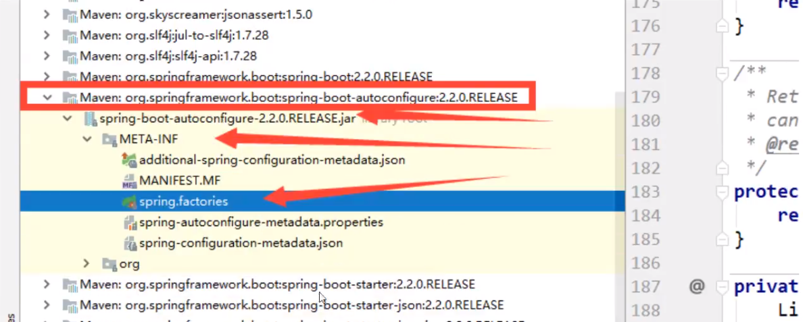
		
		


结论：springboot 所有自动配置都是在启动的时候扫描并加载： `spring.factories`所有的自动配置类都在这里面，

但是不一定生效，要判断条件是否成立，只要导入了对应的start，就有对应的启动器了，有了启动器，我们自动装配就会生效，然后就配置成功！


1. spring boot 在启动的时候，从类路径下/META-INF/spring.factories 获取指定的值
2. 将这些自动配置的类导入容器，自动配置就会失效，帮我进行自动配置
3. 以前我们需要自动配置的东西，现在spring boot 帮我们做了
4. 整合 javaEE，解决方案和自动配置的东西都在 spring-boot-autoconfigure-x.x.x.RELEASE.jar 这个包下
5. 它会吧所有需要导入的组件，以类名的方式返回，这些组件就会呗添加到容器
6. 容器中也会存在非常多的xxxAutoConfiguration的文件(@Bean)，就是这些类给容器中导入了这个场景需要的所有组件；并自动配置：@Configuration，JavaConfig！
7. 有了自动配置类，免去了我们手动编写配置文件的工作！


JavaConfig 	@Configuration	@Bean

Docker：进程


关于 SpringBoot ，谈谈理解

- 自动装配
- run()


全面接管SpringMVC的配置


# Spring Boot 配置

yaml 可以直接给实体类赋值

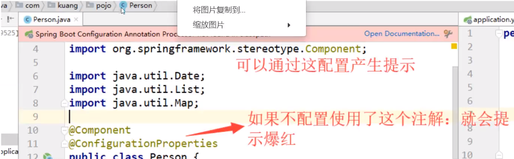


### JSR-303 校验

```java

@NotNull(Message="名字不为空")
private String userName;
@Max(value=120, message="年龄最大不能超过120")
private int age;
@Email(message="邮箱格式错误")
private String email;

//空检查
@Null		验证对象是否为空;
@NotNull	验证对象是否不为空，无法检查长度为0的字符串;
@NotBlank	检查约束字符串是不是Null还有呗Trim的长度是否大于0，只对字符串，且会去掉前后空格;
@NotEmpty	检查约束元素是否为NULL或者是Empty;

//Boolean检查
@AssertTrue		验证Boolean对象是否为true;
@AssertFalse	验证Boolean对象是否为false;

//长度检查
@Size(min= , max= )		验证对象 （Array, Collection, Map, String) 长度是否在给定的范围之内;
@Length(min=, max= ) 	Validates that the annotated string is between min and max included;

//日期检查
@Past		验证Date 和Calendar 对象是否在当前时间之前;
@Future		验证Date和Calendar对象是否在当前时间之后;
@Pattern 	验证String对象是否符合正则表达式的规则;


.....等等;

```


# Spring Boot Web 开发

jar: webapp!

自动装配

springboot 到底帮我们配置了什么，我们能不能进行修改？能修改什么？能不能扩展？

- xxxxAutoConfiguration.. 向容器中自动配置组件
- xxxxProperties：自动配置类，装配配置文件中自定义的一些内容！


要解决的问题：

- 导入静态资源....
- 首页
- jsp, 模板引擎 Thymeleaf
- 装配扩展SpringMVC
- 增删改查
- 拦截器
- 国际化


## 静态资源


```java
public void addResourceHandlers(ResourceHandlerRegistry registry) {
    if (!this.resourceProperties.isAddMappings()) {
        logger.debug("Default resource handling disabled");
    } else {
        Duration cachePeriod = this.resourceProperties.getCache().getPeriod();
        CacheControl cacheControl = this.resourceProperties.getCache().getCachecontrol()
            .toHttpCacheControl();
        if (!registry.hasMappingForPattern("/webjars/**")) {
            this.customizeResourceHandlerRegistration(
                registry.addResourceHandler(new String[]{"/webjars/**"})
                .addResourceLocations(new String[]{
                    "classpath:/META-INF/resources/webjars/"
                })
                .setCachePeriod(this.getSeconds(cachePeriod))
                .setCacheControl(cacheControl));
        }

        String staticPathPattern = this.mvcProperties.getStaticPathPattern();
        if (!registry.hasMappingForPattern(staticPathPattern)) {
            this.customizeResourceHandlerRegistration(
                registry.addResourceHandler(new String[]{staticPathPattern})
            		.addResourceLocations(WebMvcAutoConfiguration
                                          .getResourceLocations(this.resourceProperties
                                                                .getStaticLocations()))
                .setCachePeriod(this.getSeconds(cachePeriod)).setCacheControl(cacheControl));
        }

    }
}
```


总结：

1. 在springboot，我们可以使用以下方式处理静态资源
	- webjars	`localhost:8080/webjars/`
	- public, static, /**, resources  `localhost:8080/`
2. 优先级：resources > static（默认）> public


## 首页如何定制


## 模板引擎

结论：只要需要使用thmyleaf，只需要导入对应的依赖就可以了！我们将html放在我们的templates目录下即可

```java
private String prefix = "classpath:/templates/";
private String suffix = ".html";
```


在SpringBoot中，有非常多的xxxxConfiguration帮助我们配置，如果见到，需要注意！


## Web开发

1. 首页配置：
	1. 注意点：所有页面的静态资源都需要使用thymeleaf结果； 
	2. Url：@{}
2. 页面国际化“
	1. 我们需要配置i18n文件
	2. 我们如果需要在项目中进行按钮自动切换，我们需要自定义一个组件`LocaleResolver`
	3. 记得将自己写的组件配置到Spring容器中 `@Bean`
	4. #{}
3. 登录/登录拦截
4. 增删改查
	1. 员工列表展示
		1. 提取公共页面
			1. `th:fragment="sidebar"`
			2. `th:replace="~{commons/commons::topbar}"`
			3. 如果要传递参数，可以直接使用（）传参，接收判断即可
		2. 列表循环展示
	2. 添加员工
		1. 按钮提交
		2. 跳转到添加页面
		3. 添加员工成功
		4. 返回
5. CRUD结束
6. 404


前端：

- 模板：别人写好的，我们拿来用改成自己的
- 框架：组件L自己手动组合拼接！ Bootstrap, Layui, semanticui
	- 栅格系统！！
	- 导航栏
	- 侧边栏
	- 表单


1. 要知道页面长什么样子
2. 设计数据
3. 设计数据库
4. 独立化工程，壳子自动运行
5. 数据接口对接：Json、对象 all in one
6. 联调


1. 有一套自己熟悉的后台模板，工作必要！bootstrap后台模板、x-admin模板
2. 前端页面：至少自己能够通过前端框架组合出来一个网站页面
	- index
	- about
	- blog
	- post
	- user
3. 让这个网站能够独立运行

一个月！


# Druid

# Mybatis

# SpringSecurity（安全）

在web开发中，安全第一位！过滤器，拦截器

功能性需求：否

做网站，安全在什么时候考虑？设计之初

- 漏洞、隐私泄露
- 架构一旦确定


shiro、 SpringSecurity：很像


- 功能权限
- 访问权限
- 菜单权限


Aop 横切 - 配置类 - 


**简介**

Spring Securigy 是针对Spring项目的安全框架，也是Spring Boot 底层安全模块默认的技术选型，他可以时限强大的Web安全控制，对于安全控制，我们仅需要引入 spring-boot-starter-security 模块，进行少量的配置，即可以实现强大的安全管理。


记住几个类：

- WebSecurityConfigurerAdapter：自定义Security策略
- AuthenticationManagerBuilder：自定义认证策略
- @EnableWebSecurity：开启WebSecurity模式，@Enablexxx 开启某个功能

Spring Security 的两个主要目标是“认证”和“授权” （访问控制）。

“认证” （Authentication)

“授权” （Authorization）

这个概念是通用的


1. 自建一个类，继承于`WebSecurityConfigurerAdapter` 

	例子：

	```java
	//这个注解用于启用websecurity
	@EnableWebSecurity
	public class Security extends WebSecurityConfigurerAdapter {
	    //授权
	    @Override
	    protected void configure(HttpSecurity http) throws Exception {
	        http.authorizeRequests().antMatchers("/").permitAll()
	                .antMatchers("/level1/**").hasRole("vip1")
	                .antMatchers("/level2/**").hasRole("vip2")
	                .antMatchers("/level3/**").hasRole("vip3");
	
	        http.formLogin();
	    }
	
	    //认证
	    @Override
	    protected void configure(AuthenticationManagerBuilder auth) throws Exception {
	        //这里的数据应该和数据库连接的
	        //这里只是一个示例
	        auth.inMemoryAuthentication().passwordEncoder(new BCryptPasswordEncoder())
	                .withUser("admin").password(new BCryptPasswordEncoder().encode("admin"))
	                	.roles("vip1", "vip2", "vip3")
	                .and().withUser("guest").password(new BCryptPasswordEncoder().encode("guest"))
	                	.roles("vip1")
	                .and().withUser("hong").password(new BCryptPasswordEncoder().encode("hong"))
	                	.roles("vip1", "vip2");
	    }
	}
	
	```

	

2. 和数据库连接：

	```java
	@Autowired
	private DataSource dataSource;
	
	@Autowired
	public void configureGlobal(AuthenticationManagerBuilder auth) throws Exception {
	    PasswordEncoder encoder = PasswordEncoderFactories.createDelegatingPasswordEncoder();
	    auth.jdbcAuthentication().dataSource(dataSource)
	        .withDefaultSchema()
	        .withUser("admin").password(encoder.encode("admin")).roles("ADMIN", "USER")
	        .and()
	        .withUser("user").password(encoder.encode("user")).roles("USER");
	}
	```

	


CSRF，防止网站攻击

```java


//注销，并在注销后跳转到“/”页

http.logout().logoutSuccessUrl("/");
```


### * 记住我功能

```java
http.rememberme()
    //

//自定义记住我：
http.rememberme().rememberMeParameter("remeber");//此处设定用户设置的功能checkbox的name
```


### 自定义登录页：

```java
http.loginPage("/toLogin")
    .usernameParameter("user")//此处不定义的话默认接收"username"
    .passwordParameter("pwd")//同上
    .loginProcessingUrl("/login")//定义处理登录路径，不需要再controller中设置
    ;


```


# Shiro

## Shiro学习笔记

## 介绍

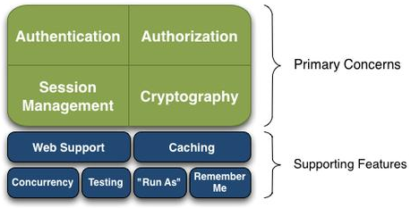

- Session Manager：会话管理，即用户登录后就是第一次会话，在没有退出之前，他的所有信息都在会话中；会话可以是普通的JavaSE环境，也可以是java环境
- Cryptography：加密，保护数据的安全性，如密码加密存储到数据库中，而不是明文存储
- Web Support： Web支持，可以非常容易的集成到web环境
- Caching：缓存
- Concurrency：Shiro这次hi多线程应用的并发验证，即，如在一个线程中开启另一个线程，能把权限自动的传播过去
- Testing：提供测试支持
- Run As：允许一个用户假装为另一个用户（如果它们允许）的身份进行访问
- Remember Me


### 架构：（外部）

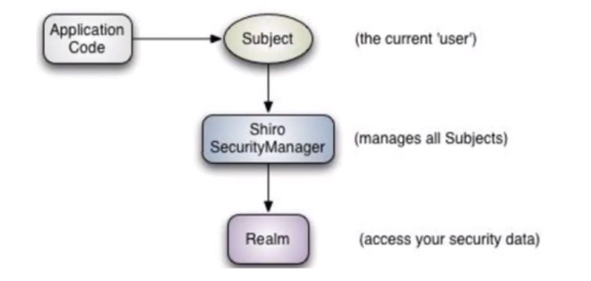

Subject：（当前用户）

Shiro SecurityManager

Realm


### 架构：（内部）

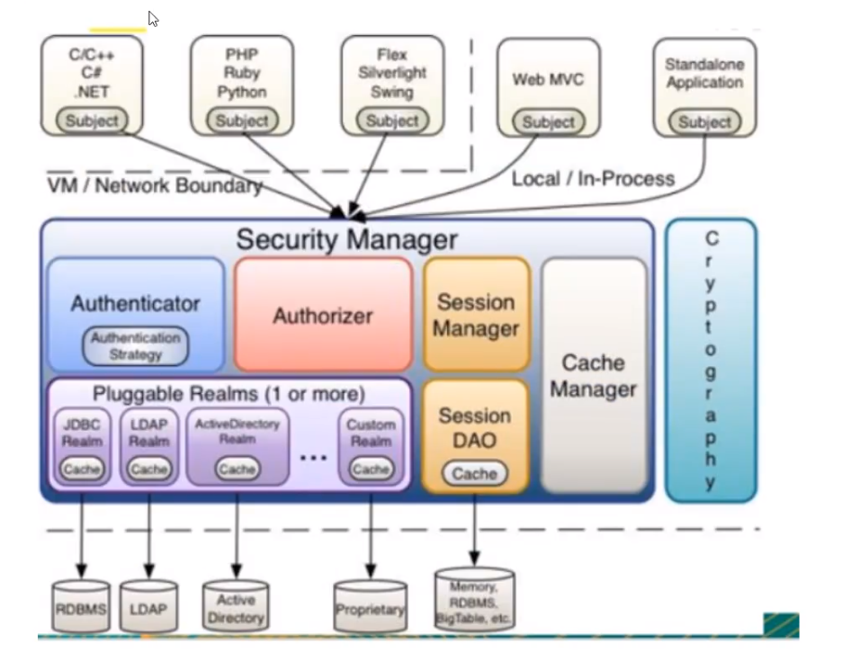


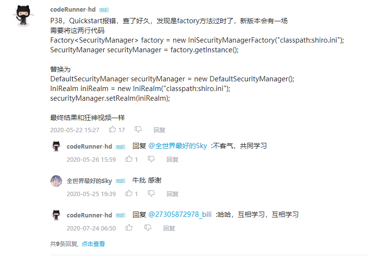


### 快速开始

1. 导入依赖
2. 配置文件
3. HelloWorld


*Spring Boot Security 都有*

```java
//获得当前用户角色 Subject
Subject currentUser = SecurityUtils.getSubject();

//通过当前用户获得Session（这个session是shiro的session）
Session session = currentUser.getSession();
session.setAttribute( "someKey", "aValue" );

//判断当前用户是否被认证
if ( !currentUser.isAuthenticated() ) {
    //创建令牌：Token。在shiro.ini中设置一些属性
    UsernamePasswordToken token = new UsernamePasswordToken("lonestarr", "vespa");
    //设置记住我功能
    token.setRememberMe(true);
    //执行登录操作
    currentUser.login(token);
}

//获得当前用户的认证
log.info( "User [" + currentUser.getPrincipal() + "] logged in successfully." );

//用户角色的判定
if ( currentUser.hasRole( "schwartz" ) ) {
    log.info("May the Schwartz be with you!" );
} else {
    log.info( "Hello, mere mortal." );
}

//获得当前用户的权限
//粗粒度
if ( currentUser.isPermitted( "lightsaber:weild" ) ) {
    log.info("You may use a lightsaber ring.  Use it wisely.");
} else {
    log.info("Sorry, lightsaber rings are for schwartz masters only.");
}
//细粒度
if ( currentUser.isPermitted( "winnebago:drive:eagle5" ) ) {
    log.info("You are permitted to 'drive' the 'winnebago' with license plate (id) 'eagle5'.  " +
                "Here are the keys - have fun!");
} else {
    log.info("Sorry, you aren't allowed to drive the 'eagle5' winnebago!");
}
currentUser.logout(); //removes all identifying information and invalidates their session too.
```


### Shrio 配置，实现登录拦截

```java
@Configuration
public class ShiroConfig {
    
    //ShiroFillterFactoryBean:3
    @Bean
    public ShiroFilterFactoryBean getShiroFilterFactoryBean(@Qualifier("securityManager")
        	DefaultWebSecurityManager defaultWebSecurity)
    {
        ShiroFilterFactoryBean bean = new ShiroFilterFactoryBean();
        
        //设置安全管理器
        bean.setSecurityManager(defaultWebSecurity);
        
        //添加shrio的内置过滤器
        /*
        	anon:	无需认证即可访问 
        	authc:	必须认证才可访问
        	user:	必须拥有记住我功能才能访问
        	perms:	拥有对某个资源的访问权限才可以访问
        	role: 	拥有某个角色权限才可访问
        */
        
        Map<String, String > filterMap = new LinkedHashMap<>();
        
//        filterMap.put("/user/add", "authc");
//       filterMap.put("/user/update", "authc");
        filterMap.put("/user/*", "authc");
        
        bean.setFilterChainDefinitionMap(filterMap);
        
        return bean
    }
    
    @Bean(name="securityManager")
    public DefaultWebSecurityManager getDefaultWebSecurityManager(@Qualifier("userRealm")
        	UserRealm userRealm)
    {
        DefaultWebSecurityManager securityManager = new DefaultWebSecurityManager();
        //关联UserRealm
        securityManager.setRealm(userRealm);
        return securityManager;
    }
    
    //创建realm对象，需要自定义类
    @Bean
    public UserRealm userRealm(){
        return new UserRealm();
    }
    
    
}


class UserRealm extands AuthorizingRealm{
    @Override
    protected Authorization doGetAuthorizationInfo(PrincipalCollection principals){
        sout("授权");
        return null;
    }
    
    @Override
    protected AuthenticationInfo doGetAuthenticationInfo(AuthenticationToken token)
        	throws AuthenticationException
    {
        sout("认证");
        return null;
    }
}
```


整合mybatis：

将mybatis内容完成

再获取用户密码后，根据username查询用户

将内容传递给shiro：

```java
return new SimpleAuthenticationInfo("", user.getPwd(), "");
```


### 项目指引:

application.yml

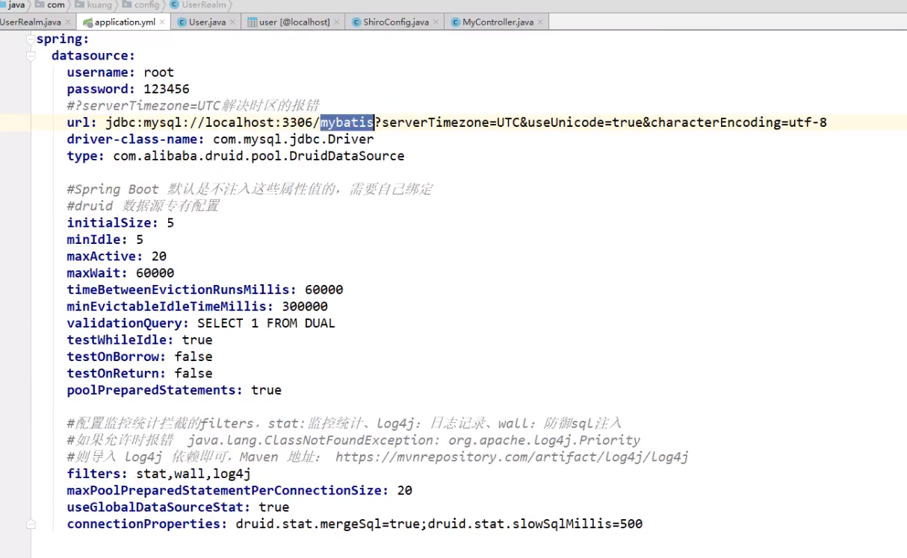


userrealm

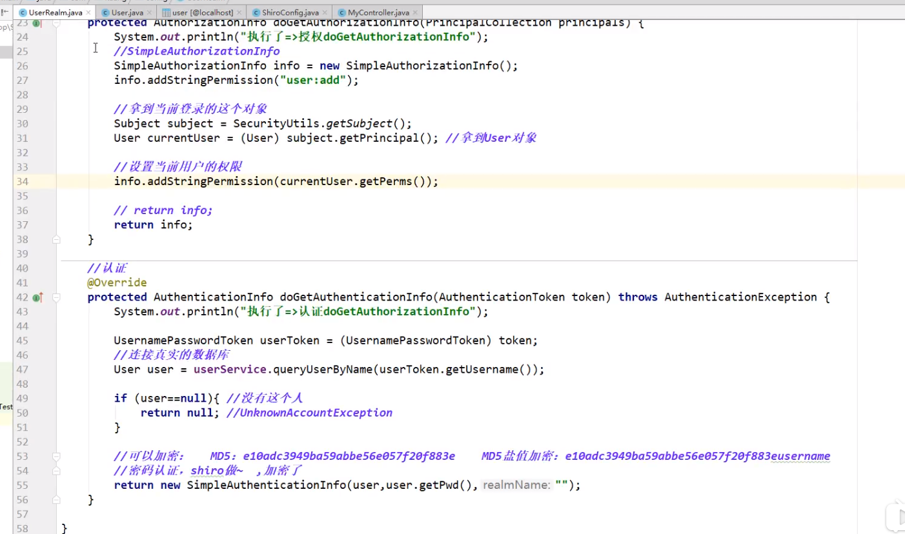


controller

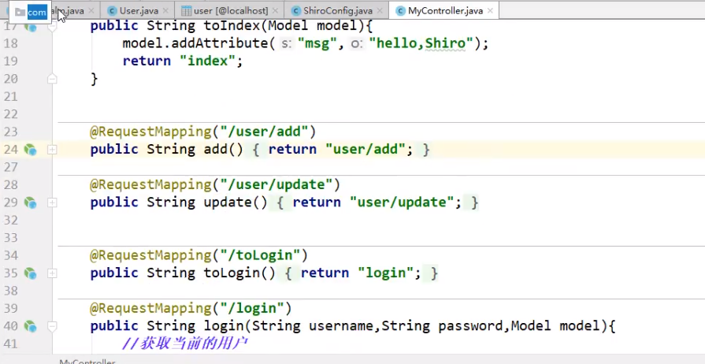


shiroconfig

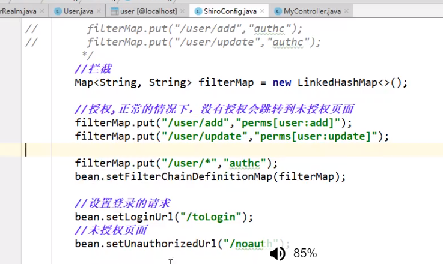


项目结构：

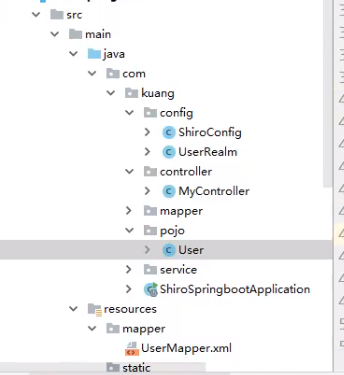


# 任务

## 异步任务

在异步方法上方定义@Async

在启动类上方定义@EnableAsync

即可


## 邮件任务

spring-boot-starter-mail


导包后，配置文件：

```yaml
spring:
	mail:
		username: #邮箱
		password: #授权码
		#发送的服务器,后缀看邮箱
		host: smtp.qq.com
		//QQ的需要启动ssl加密
		properties:
			mail:
				smtp:
					ssl:
						enable: true
```


使用：

```java
@Autowired
JavaMailSenderImpl  mailSender

//简单邮件
public void function{
    SimpleMailMessage mailMessage = new Sim;
    
    mailMessage.setSubJect("标题");
    mailMessage.setText("正文");
    
    mailMessage.setFrom("来自");
    mailMessage.setTo("对象");
    
    mailSender.send(mailMessage);
}


//复杂邮件
public void function2(){
    MimeMessage mimeMessage = new MimeMessage();
//    mailSender.create//
    
    MimeMessageHelper helper = new MimeMessageHelper(mimeMessage, true);
    
    helper.setSubject("标题");
	helper.setText("<p>内容</p>", true);
    
    //附件
    helper.addAttachment("文件名1", new File("文件路径+名字"));
    helper.addAttachment("文件名2", new File("文件路径+名字"));
    
    //
    setTo();
    setFrom();
    
    
    mailSender.send(mimeMessage);
    
    
}

```


## 定时任务

```
TaskScheduling	//任务的调度者
TaskExecutor	//任务的执行者

@EnableScheduler	//开启定时功能的注解
@Scheduled(cron) //什么时候执行

使用的cron表达式
//秒 分 时 日 月 周几
```


启动类上使用@EnableScheduler

cron学习：https://www.cnblogs.com/junrong624/p/4239517.html

cron例子：

```markdown
# 
0 0 10,14,16 * * ? 每天上午10点，下午2点，4点
0 0/30 9-17 * * ? 朝九晚五工作时间内每半小时
0 0 12 ? * WED 表示每个星期三中午12点
"0 0 12 * * ?" 每天中午12点触发
"0 15 10 ? * *" 每天上午10:15触发
"0 15 10 * * ?" 每天上午10:15触发
"0 15 10 * * ? *" 每天上午10:15触发
"0 15 10 * * ? 2005" 2005年的每天上午10:15触发
"0 * 14 * * ?" 在每天下午2点到下午2:59期间的每1分钟触发
"0 0/5 14 * * ?" 在每天下午2点到下午2:55期间的每5分钟触发
"0 0/5 14,18 * * ?" 在每天下午2点到2:55期间和下午6点到6:55期间的每5分钟触发
"0 0-5 14 * * ?" 在每天下午2点到下午2:05期间的每1分钟触发
"0 10,44 14 ? 3 WED" 每年三月的星期三的下午2:10和2:44触发
"0 15 10 ? * MON-FRI" 周一至周五的上午10:15触发
"0 15 10 15 * ?" 每月15日上午10:15触发
"0 15 10 L * ?" 每月最后一日的上午10:15触发
"0 15 10 ? * 6L" 每月的最后一个星期五上午10:15触发
"0 15 10 ? * 6L 2002-2005" 2002年至2005年的每月的最后一个星期五上午10:15触发
"0 15 10 ? * 6#3" 每月的第三个星期五上午10:15触发
```


