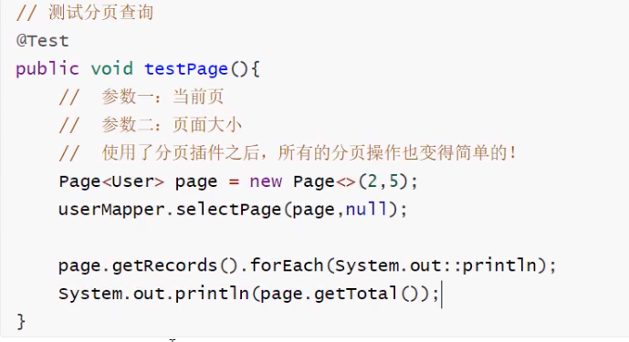
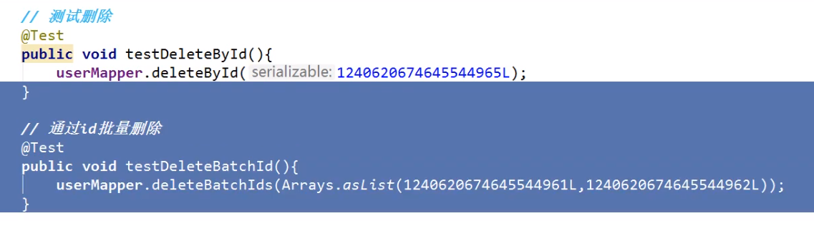
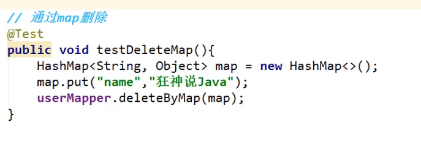
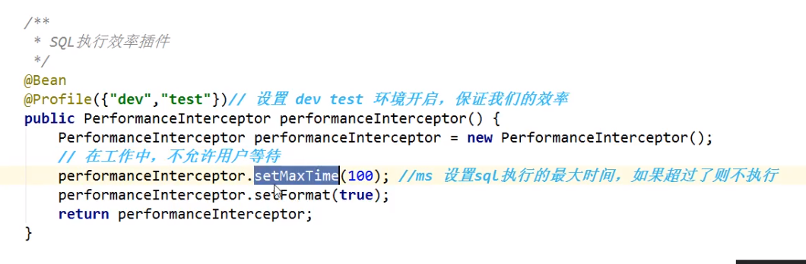
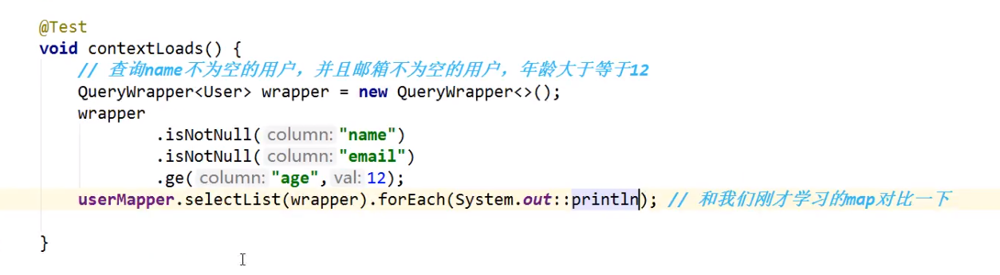
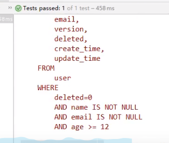
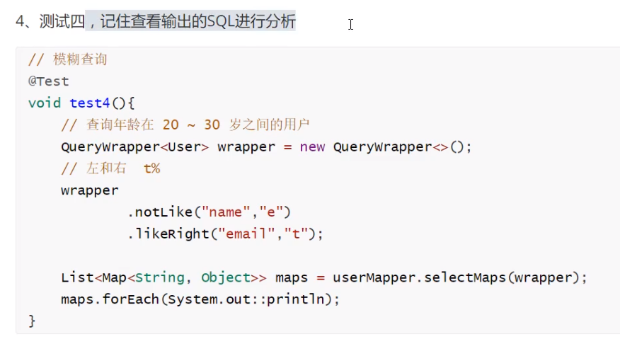
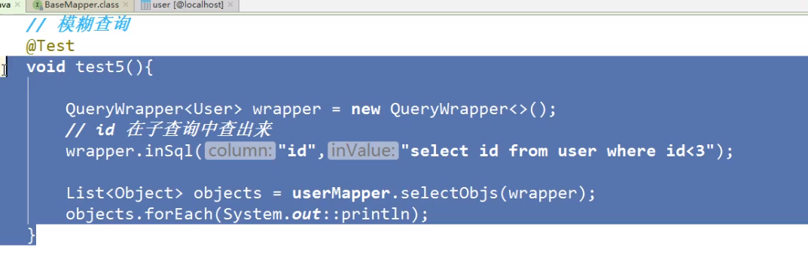

# Mybatis-Plus学习笔记

## 快速入门：

见官方文档

## 配置日志：

```yaml
mybatis-plus:
  configuration:
    log-impl: org.apache.ibatis.logging.stdout.StdOutImpl
```


## CRUD扩展

### 插入操作

> insert

```java
//测试插入
public void testInsert(){
	User user=new User();
    user.setName("");
    user.setAge(3);
    user.setEmail("@qq.com");
    
    int result = userMapper.insert(user) ; //自动生成id
    sout(result);
    sout(user);
}
```


> 数据库插入的id默认值为：全局唯一id

### 主键生成策略

> 默认 ID_WORKER 全局唯一id

分布式系统唯一id生成：


**雪花算法**

snowflake是Twitter开源的分布式id生成算法，结果是一个long型的id，其核心思想是：

使用41bit作为毫秒数。10bit作为机器的id（5个bit是数据中心，5个bit是机器id），12bit作为毫秒内的流水号（每毫秒每节点可以产生4096个id），最后还有一个符号位，永远是0.


> 主键自增

需要配置配置主键自增：

1、 实体类字段上@TableId(type = IdType.AUTO)

2、 数据库字段一定要是自增！

3、 测试插入


> 其余

``` java
public enum IdType{
    AUTO,	//自增
    NONE,	//未设置主键
    INPUT,	//手动输入
    ID_WORKER,	//默认全局唯一id
    UUID,	//全局唯一id
    ID_WORKER_STR	//ID_WORKER字符串表示法
}
```


### 更新操作


```java
@Test
public void testUpdate(){
    User user = new User();
    //通过条件自动拼接动态sql
    user.setid("");
    user.setAge(3);
    user.setName("@qq.com");
    
    //参数是一个对象
    int i = userMapper.updateById(user);
    sout(i);
}
```


**所有的sql都是自动帮你填充的**


### 自动填充

创建时间、修改时间！这些个操作一般都是自动化完成的！不需要手动更新！

阿里巴巴手册：所有数据库表：`gmt_create`（创建时间）, `gmt_modified`（修改时间）

> 方式一： 数据库级别的修改（工作中不允许修改数据库）

1、 在表中新增字段  `create_time`, `update_time`

2、 为字段新增默认：`CURRENT_TIMESTAMP`

(下滑线连接命名，可自动转换成驼峰命名)


> 方式二：代码级别

1、删除数据库默认值、更新操作！

2、实体类字段上需要增加注解

```java
@TableField(fill = FieldFill.INSERT)
private Date createTime;

@TableField(fill = FieldFill.INSERT_UPDATE)
private Date updateTime;
```

3、编写处理器来处理这个注解即可

新建包handler（处理器）

官网：自动填充

新建自己的处理器

继承MetaObjectHandler

```java
@Slf4j
@Component// 一定不要忘记把处理器加到IOC容器中！
public class MyMetaObjectHandler implements MetaObjectHandler{
    // 插入时的填充策略
    @Override
    public void insertFill(MetaObject metaObject){
        Log.info("start insert fill......");
        // setFieldValByName(String fieldName, Object fieldVal, MetaObject metaObject)
        this.setFieldValByName("createTime", new Date(), metaObject);
        this.setFieldValByName("updateTime", new Date(), metaObject);
    }
    
    // 更新时的的填充策略
    @Override
    public void updateFill(MetaObject metaObject){
        Log.info ("Start update fill....");
        this.setFieldValByName("updateTime", new Date(), metaObject);
    }
}
```


> 官网有给出新的方法

4、 测试


### 乐观锁

> 乐观锁：十分乐观，总是认为不会出现问题，无论干什么都不去上锁。如果出现了问题，再次更新值测试
>
> 悲观锁：十分悲观，总是认为会出现问题，无论干什么都会上锁，再去操作


这里主要讲解乐观锁机制：

> 官网--》 乐观锁机制

乐观锁实现的方式：

- 取出记录时，获取当前version
- 更新时，带上这个version
- 执行更新时，set version = newVersion where version = oldVersion
- 如果version不对，就更新失败


```sql
乐观锁：1、先查询，获得版本号 version = 1

-- A
update user set name = "kuangshen", version = version + 1
where id = 2 and version = 1

-- B
update user set name = "kuangshen" , version = version + 1
where id = 2 and version = 1
```


1、 给数据库增加version字段

2、 实体类加对应的字段：

```java
@Version	//乐观锁version注解
private Integer version
```

3、 注册组件

```java
//扫描mapper文件夹
@MapperScan("")
@EnableTransactionManagement //默认开启的
@Configuration
public class MyBatisPlusConfig{

//注册乐观锁插件
	@Bean
	public OptimisticLockerInterceptor optimisticLockerInterceptor(){
        return new OptimisticLockerInterceptor();
    }
}
```


测试：

```java
@Test
public void testOptimisticLocker2(){
    //线程1
    User user = userMapper.selectById(1L);
    user.setName("kuangshen1111");
    user.setEmail("24736743@qq.com");
    
    //模拟另外一个线程执行了插队操作
    User user2 = userMapper.selectById(1L);
    user2.setName("kuangshen222");
    user2.setEmail("24736743@qq.com");
    userMapper.updateById(user2);
    
    userMapper.updateById(user); //如果没有乐观锁，就会覆盖插队线程的值！
}
```


1. 测试查询
2. 测试批量查询
3. 测试map（条件）查询


### 分页查询

使用很多

1、 原始：limit

2、 插件 第三方插件

3、 mp内置分页插件

```java
//Spring boot方式
@EnableTransactionManagement
@Configuration
@MapperScan("com.baomidou.cloud.service.*.mapper*")
public class MybatisPlusConfig {

    @Bean
    public PaginationInterceptor paginationInterceptor() {
        PaginationInterceptor paginationInterceptor 
            = new PaginationInterceptor();
        // 设置请求的页面大于最大页后操作， true调回到首页，false 继续请求  默认false
        // paginationInterceptor.setOverflow(false);
        // 设置最大单页限制数量，默认 500 条，-1 不受限制
        // paginationInterceptor.setLimit(500);
        // 开启 count 的 join 优化,只针对部分 left join
        paginationInterceptor.setCountSqlParser(new JsqlParserCountOptimize(true));
        return paginationInterceptor;
    }
}
```


测试：





### 删除



### 逻辑删除

> 物理删除：数据库中直接删除
>
> 逻辑删除：通过一个变量让他失效

1、 增加一个deleted字段

2、 实体类中增加属性：

```java
@TableLogic
private Integer deleted;
```


3、 配置

```java
@Bean
public ISqlInjector sqlInjector(){
    return new LogicSqlInjector();
}
```


4、 配置逻辑删除：

```yaml
mybatis-plus:
	global-config:
		db-config:
			logic-delete-value: 1
			logic-not-delete-value: 1
```


5、测试

（做的是删除这件事，但是实际上是更新操作）


### 性能分析插件

> 只要超过了设定的时间就会爆出异常


平时开发，会遇到一些慢sql

mp提供了性能分析器，如果超过这个时间就停止运行




#### 第三方性能分析插件

> 在3.2.0版本中，mybatis-plus移除了性能分析插件，推荐使用p6spy插件

https://mp.baomidou.com/guide/p6spy.html

进入官网可看到详细的配置过程


> 要输出到文件，可以注释掉配置中appender
>
> 增加logfile=?作为输出路径

配置完成后即可使用了


使用性能分析，可以提高效率


### 条件构造器

十分重要：wrapper

写一些复杂的sql可以通过它






模糊查询






### 代码自动生成器