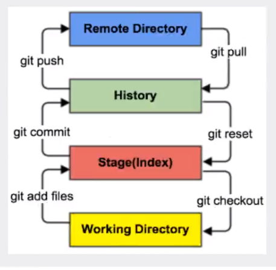

# Git学习笔记

## 1、介绍

> 常见的版本控制工具

- **GIt**
- **SVN** ( Subversion )
- **CVS**(Concurrent Versions System )
- **VSS**( Micorosoft Visual SourceSafe )
- **TFS**(Team Foundation Server )
- **Visual Studio Online**

> 版本控制的分类

1、本地版本控制

2、集中版本控制

## 2、Git 基本架构

## 3、忽略文件

在 .gitignore 中编写忽略的内容

![[git-gitignore.png]]

# 4、公钥

