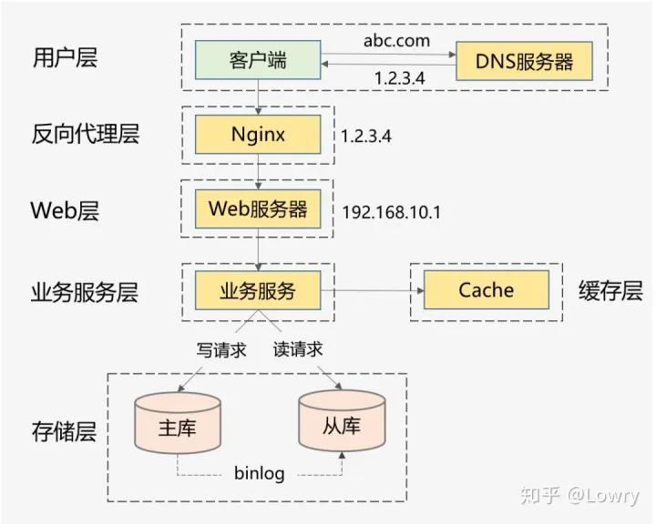

# 通用设计方法
## 纵向扩展（Scale-up）
1. 提升硬件性能：增加内存、升级CPU、提高容量、使用SSD等。
2. 提升软件性能：使用缓存减少IO次数，使用并发、异步来增加吞吐量。

## 横向扩展（Scale-out）
1. 分层架构

上面这种图是互联网最常见的分层架构，当然真实的高并发系统架构会在此基础上进一步完善。比如会做动静分离并引入CDN，反向代理层可以是LVS+Nginx，Web层可以是统一的API网关，业务服务层可进一步按垂直业务做微服务化，存储层可以是各种异构数据库。

2. 各层进行水平扩展：无状态水平扩容，有状态做分片路由。业务集群通常能设计成无状态的，而数据库和缓存往往是有状态的，因此需要设计分区键做好存储分片，当然也可以通过主从同步、读写分离的方案提升读性能。

# 具体实践方案
## 高性能的实践方案
1. 集群部署，通过负载均衡减轻单机压力
2. 多级缓存，包括静态数据使用CDN、本地缓存、分布式缓存等，以及对缓存场景中的热点key、缓存穿透、缓存并发、数据一致性等问题的处理。
3. 分库分表和索引优化，以及借助搜索引擎解决复杂查询问题。
4. 考虑NoSQL数据库的使用，比如HBase、TiDB等，但是团队必须熟悉且有较强的运维能力。
5. 异步化，将次要流程通过多线程、MQ、